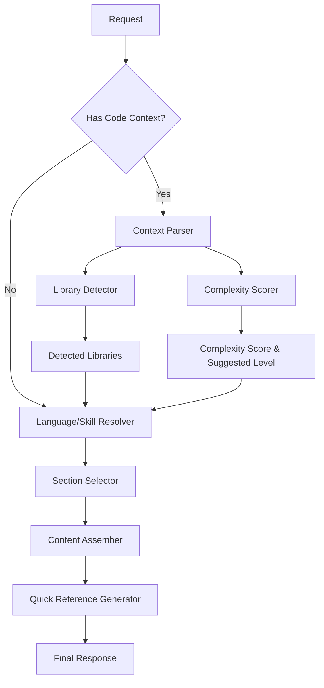

# generate_cheatsheet - Context-Aware Cheat Sheet Generator

**Tool Name:** `generate_cheatsheet`  
**Version:** 0.9.0 (Phase 13)  
**Status:** ✅ Production Ready  
**Architecture:** Rule-Based / Context-Aware Pipeline  
**Response Time:** <200ms (Benchmark Average)

---

## 1. Overview

The `generate_cheatsheet` tool has been upgraded from a static template generator to a **context-aware intelligence system**. It analyzes input code to detect libraries, architectural patterns, and code complexity, generating highly relevant cheat sheets tailored to the user's actual context.

### Key Capabilities
- **Context Analysis**: Parses multi-block code to understand what the user is working on.
- **Library Intelligence**: Detects 20+ libraries (e.g., `pandas`, `fastapi`, `asyncio`, `react`, `express`) and provides specialized templates for supported ones.
- **Language Support**: Full support for **Python**, **JavaScript**, and **TypeScript**.
- **Complexity Scoring**: Mathematically scores code complexity (0-100) to auto-suggest skill levels (Beginner/Intermediate/Expert).
- **Adaptive Content**: Prioritizes library-specific sections over generic language syntax when libraries are present.

---

## 2. Detailed Workflow (The 8-Step Pipeline)

The tool follows a strict synchronous pipeline to ensure performance (<200ms) and reliability (no LLM hallucinations).



### Step-by-Step Logic

1.  **Parse Context**: `context_parser.py` splits input into analyzeable blocks, removing Markdown fences.
2.  **Detect Libraries**: `library_detector.py` scans blocks against 15+ regex signatures.
3.  **Score Complexity**: `complexity_scorer.py` counts features (decorators, classes, async) to compute a score.
4.  **Resolve Strategy**:
    *   **Language**: Explicit argument > Auto-detected language.
    *   **Skill Level**: Explicit argument > Complexity-suggested level.
5.  **Select Sections**: `section_selector.py` picks the top 5-7 most relevant topics:
    *   *Priority 1*: Detected Library Guides (e.g., "Pandas DataFrames").
    *   *Priority 2*: Skill-appropriate Core Topics (e.g., "Advanced IO" for Expert).
6.  **Assemble**: Merges templates from `enhanced_templates.py`.
7.  **Quick Ref**: Generates a skill-specific lookup table.
8.  **Return**: JSON response with metadata and Markdown.

---

## 3. Component Architecture (Actual Flows)

### A. Context Parser (`context_parser.py`)
*   **Input**: Raw string from frontend (often contains `// language` headers or tripple backticks).
*   **Logic**: 
    1.  Normalize newlines.
    2.  Split by `---` or markdown block boundaries.
    3.  Strip language identifiers (`// python`, ````python`).
*   **Output**: Structured `{'blocks': [...], 'total_lines': N}`.

### B. Library Detector (`library_detector.py`)
*   **Input**: Code blocks.
*   **Logic**: Uses pre-compiled Regex for high performace.
    *   *Python*: `import pandas`, `from fastapi import`, `sqlalchemy.orm`.
    *   *JS/TS*: `import ... from 'react'`, `require('express')`.
*   **Supported Detection**:
    *   **Data**: `pandas`, `numpy`, `matplotlib`, `scikit-learn`
    *   **Web**: `fastapi`, `flask`, `django`, `react`, `axum` (Rust)
    *   **System**: `asyncio`, `aiohttp`, `pydantic`, `sqlalchemy`, `pytest`
*   **Output**: List of unique library names (sorted).

### C. Complexity Scorer (`complexity_scorer.py`)
*   **Input**: Code blocks.
*   **Features Tracked**:
    *   `imports` (weight 1)
    *   `classes` (weight 2)
    *   `decorators` (weight 3)
    *   `async_functions` (weight 3)
    *   `context_managers` (weight 3)
    *   `generators` (weight 3)
*   **Algorithm**: `Score = sum(count * weight)`. Cap at 100.
*   **Thresholds**:
    *   0-9: **Beginner**
    *   10-29: **Intermediate**
    *   30+: **Expert**
*   **Output**: `{'score': int, 'suggested_level': str}`.

### D. Section Selector (`section_selector.py`)
*   **Input**: Language, Skill Level, Detected Libraries.
*   **Safety Net**: If no templates match, defaults to Base Language Beginner templates (Guaranteed non-empty response).
*   **Selection Logic**:
    1.  Initialize list with strictly relevant Library Sections (max 3).
    2.  Fill remaining slots (up to 7) with Core Language Sections tailored to Skill Level.
        *   e.g. `python/expert` -> Decorators, Generators, Metaclasses.

### E. Enhanced Templates (`enhanced_templates.py`)
*   **Storage**: Nested Dictionary Structure.
*   **Coverage (Python)**:
    *   **Beginner**: Variables, Control Flow, Functions.
    *   **Intermediate**: Data Structures, File I/O, Error Handling, Modules.
    *   **Expert**: Decorators, Generators, Context Managers, Advanced Classes.
    *   **Libraries**: Pandas (DataFrame ops), FastAPI (Routes/Pydantic), Asyncio (Loops/Tasks).
    *   **JavaScript/TypeScript**:
    *   **Beginner**: Variables (let/const), Arrow Functions, Promises.
    *   **Intermediate**: Async/Await, Modules, Error Handling (try/catch).
    *   **Libraries**: React (Hooks), Express (Middleware), Axios.

---

## 4. API Specification

### Endpoint
`POST /api/gateway`

### Request Schema

```json
{
  "name": "generate_cheatsheet",
  "arguments": {
    "language": "python",          // Optional (Auto-detected if omitted)
    "skill_level": "intermediate", // Optional (Defaults to "beginner" or auto-scored)
    "code_context": "import pandas as pd..." // Optional (Source for detection)
  }
}
```

### Response Schema

```json
{
  "success": true,
  "data": {
    "language": "python",
    "skill_level": "intermediate",
    "detected_libraries": ["pandas"],
    "supported_libraries": ["pandas"], // Subset of detected that have full templates
    "complexity_score": 15,
    "sections": [
      { "title": "Pandas DataFrames" },
      { "title": "Data Structures" },
      { "title": "File I/O" }
    ],
    "markdown": "# Python Cheat Sheet...\n## Pandas DataFrames\n..."
  }
}
```

---

## 5. Usage Examples

### Scenario 1: The Learner (Beginner)
**Input**:
```json
{"language": "python", "skill_level": "beginner"}
```
**Result**:
- **Topics**: syntax, loops, basic functions.
- **Focus**: Syntax memorization.

### Scenario 2: The Data Scientist (Context-Aware)
**Input**:
```json
{
  "code_context": "df = pd.read_csv('data.csv')\ndf.groupby('id').sum()", 
  "skill_level": "intermediate"
}
```
**Result**:
- **Detected**: `pandas`.
- **Topics**: **Pandas Loading**, **Pandas Grouping**, Python Data Structures.
- **Focus**: Library API usage.

### Scenario 3: The System Architect (Expert)
**Input**:
```json
{
  "code_context": "@app.get('/')\nasync def root():...", 
  "skill_level": "expert"
}
```
**Result**:
- **Detected**: `fastapi`, `asyncio`.
- **Score**: 35 (Expert).
- **Topics**: **FastAPI Routes**, **Async/Await**, Decorators, Context Managers.
- **Focus**: Performance and Architecture.
