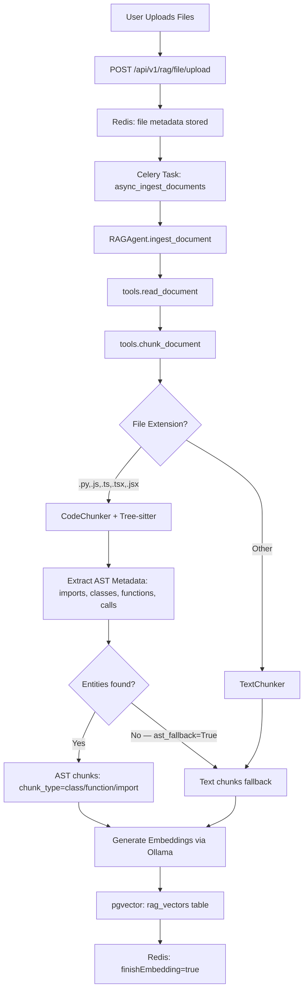

# RAG Integration Flow

**Version:** 1.4.0  
**Last Updated:** 2026-05-25  
**Last Verified:** 2026-05-25 — Cross-file graph expansion fixed (`resolve_cross_file_edges`); code graph API endpoints added

This document details the integration flow of the RAG pipeline, including Phase 12A query intelligence features.

---

## Complete Ingestion Flow

### High-Level Pipeline



### Primary Upload Path

The primary ingestion path is file upload, **not** the legacy `ingest-async` endpoint:

```
POST /api/v1/rag/file/upload
  → multipart/form-data with files=@<file>
  → Redis: file metadata (status=pending)
  → Celery task queued → CodeChunker/TextChunker → embeddings → pgvector
  → Redis: status=success, finishEmbedding=true
```

Poll for completion: `GET /api/v1/rag/file/{file_id}` until `finishEmbedding: true`.

### Detailed Call Chain

```
1. HTTP Request
   POST /api/v1/rag/file/upload
   Headers: Authorization: Bearer <tenant_jwt>
   Body: multipart/form-data, files=@<file>

2. API Router (src/api/routers/rag.py)
   → Saves file to disk under data/uploads/users/{tenant_id}/default/
   → Creates Redis metadata entry: file:{file_id}
   → Queues Celery task: async_ingest_documents(file_path, collection_name, file_id)

3. Celery Task (src/workers/tasks/rag_tasks.py)
   @shared_task async_ingest_documents(file_path, collection_name, file_id, tenant_id)
   → Initializes RAGAgent with collection_name=user_{tenant_id}
   → Calls agent.ingest_document(file_path)
   → Invalidates graph cache: redis DEL rag_graph:v2:{collection_name}

4. RAGAgent.ingest_document (src/agents/rag/agent.py)
   → Delegates to tools.ingest_documents()

5. tools.ingest_documents (src/tools/rag/tools.py)
   → Calls chunk_document(text, file_path)

6. chunk_document → CodeChunker or TextChunker
   → .py/.js/.ts/.tsx/.jsx: CodeChunker.chunk(text, file_path)
   → other: TextChunker.chunk(text, file_path)

7A. CodeChunker (src/agents/rag/chunking/code_chunker.py)
    → Tree-sitter AST parse
    → _extract_imports(): import chunks
    → _extract_entities(): class + function chunks
    → If 0 entities found: ast_fallback=True → TextChunker fallback
    → Returns chunks with metadata: chunk_type, name, source, calls, imports

7B. TextChunker: RecursiveCharacterTextSplitter → text chunks

8. Generate embeddings via OllamaEmbeddings (nomic-embed-text, 768-dim)

9. pgvector: INSERT INTO rag_vectors (chunk_id, content, metadata, embedding)
   collection_name = user_{tenant_id}

10. Redis: update file:{file_id} → status=success, finishEmbedding=true
```

---

## Phase 12A Retrieval Flow (Query Intelligence)

### Enhanced Pipeline

```
1. User Query
   POST /api/v1/rag/chunk/semanticSearchForChat
   Headers: Authorization: Bearer <tenant_jwt>
   Body: {
     "messageId": "...",
     "userQuery": "...",
     "fileIds": ["uuid1", "uuid2"],   # optional filter
     "top_k": 5
   }

2. JWTAuthMiddleware
   → Validates HS256 JWT, extracts tenant_id claim
   → Sets request.state.tenant_id
   → collection_name = user_{tenant_id}

3. Intent Classification (3-tier)
   → Tier 1: Rule-based keywords (0ms)
   → Tier 2: LLM classification (if enabled, ~100ms)
   → Tier 3: Fallback → "general"
   → Returns: code_search | explain | debug | general

4. Query Expansion (intent-aware)
   → Generate 2-3 related queries based on intent

5. Semantic Cache Check
   → Cosine similarity ≥ 0.92 → return cached result (<50ms)

6. Vector/Hybrid Search
   → fileIds present: vector-only search with WHERE metadata->>'file_id' = ANY(fileIds)
   → No fileIds: hybrid BM25 + vector with RRF fusion (if ENABLE_HYBRID_SEARCH=true)
   → top_k × VECTOR_SEARCH_CANDIDATES=30 initial candidates

7. Graph Context Expansion (Phase 12A, when ENABLE_CODE_GRAPH=true)
   → For each anchor chunk: build QID = tenant::source::name
   → CodeGraph.get_related(qid, depth=2, max_results=3)
   → BFS on calls + imports edges
   → vector_store.get_chunk_by_qualified_id(related_qid) for each
   → Append as is_graph_expansion=True candidates
   ✅ Cross-file expansion fixed 2026-05-25 via resolve_cross_file_edges()

8. Cross-Encoder Reranking (ENABLE_RERANKING=true)
   → ms-marco-MiniLM-L-6-v2, top_k × 2 candidates
   → Sigmoid normalization, code-type boost factors
   → Threshold fallback ladder

9. Orphan Filter (src/api/routers/rag.py)
   → Drops chunks whose file_id has no file:{id} key in Redis
   → Prevents stale pgvector rows from appearing after file deletion

10. Response
    {
      "chunks": [...],
      "queryId": "...",
      "expansion_count": N
    }
```

### Analytics Endpoints

| Endpoint | Purpose |
|----------|---------|
| `GET /api/rag/analytics/intent-distribution` | Intent classification stats |
| `GET /api/rag/analytics/expansion-quality` | Query expansion metrics |
| `GET /api/rag/analytics/cache-by-intent` | Cache hit rates by intent |
| `GET /api/rag/analytics/fallback-usage` | Fallback trigger frequency |
| `GET /api/rag/metrics` | Overall system metrics |

---

## Graph Expansion Detail

Graph BFS runs automatically inside `retrieve_with_reranking` when `ENABLE_CODE_GRAPH=true` (no per-request flag). It runs after initial vector search, before reranking.

```
For each anchor chunk in initial_results:
  ↓
  name = metadata.get("name")        # entity name, e.g. "CacheStore"
  source = metadata.get("source")    # full file path
  qid = f"{tenant_id}::{source}::{name}"
  ↓
  if qid not in code_graph → skip (no edges)
  ↓
  related_qids = CodeGraph.get_related(qid, depth=2, max_results=3)
    → BFS traversal over calls + imports edges
  ↓
  for each related_qid:
    chunk = vector_store.get_chunk_by_qualified_id(related_qid, ...)
    if chunk: append with is_graph_expansion=True, expanded_from=qid
  ↓
  Merge with initial_results → deduplicate → pass to reranker
```

**Provenance fields on expanded chunks:**

```python
chunk_dict = {
    "id": related_chunk.id,
    "content": related_chunk.content,
    "metadata": related_chunk.metadata,
    "score": 0.0,                    # reranker will score it
    "is_graph_expansion": True,
    "expanded_from": qid,            # anchor QID that triggered this expansion
}
```

**Cross-file expansion (fixed 2026-05-25 — Issue #6):** Previously the graph resolved call targets within the same source file, so `user-repository.ts::UserRepository → user-repository.ts::CacheStore` was created instead of the correct cross-file edge. `resolve_cross_file_edges()` is now called after every cold-start build and Redis cache load. It detects dangling QIDs (in `_graph` but not `_metadata`) and rewires them to the real definitions in the correct file — unambiguously. **Both intra-file and cross-file expansion now work.**

---

## AST Chunking Detail

### CodeChunker Tree-sitter Queries

**Python** (works without issues):
```python
query_str = """
(function_definition name: (identifier) @func_name) @function
(class_definition name: (identifier) @class_name) @class
"""
```

**TypeScript/JavaScript** (fixed 2026-05-24):
```python
# TypeScript grammar differences:
# 1. Exported declarations are wrapped: export_statement > class_declaration
# 2. Class names use type_identifier (not identifier) in TS grammar
query_str = """
(function_declaration name: (identifier) @func_name) @function
(class_declaration name: (type_identifier) @class_name) @class
(export_statement (function_declaration name: (identifier) @func_name) @function)
(export_statement (class_declaration name: (type_identifier) @class_name) @class)
"""
```

**ast_fallback behavior:** When 0 entities are extracted, `ast_fallback=True` is set in chunk metadata and the file falls back to text chunking. `chunkingStatus` still shows `"success"` — callers cannot detect this from the upload response alone. See Issue #7 in known_issues.md.

### Chunk Metadata Schema

```json
{
  "chunk_type": "class",          // function | class | import | text
  "name": "CacheStore",           // entity name; "chunk_N" for text fallback
  "language": "typescript",
  "source": "/app/data/uploads/.../_cache.ts",
  "start_line": 4,
  "end_line": 74,
  "imports": [],
  "calls": ["CacheEntry"],        // detected calls/uses within entity
  "docstring": "",
  "ast_fallback": false,          // true when AST extraction failed
  "file_id": "96af7ff2-...",
  "chunk_id": "f26fc5f6-...",
  "chunk_index": 1,
  "total_chunks": 3,
  "tenant_id": "6989d05d...",
  "collection_name": "user_6989d05d..."
}
```

---

## Graph Rebuild Flow

### RAGAgent.init_graph

```python
async def init_graph(self) -> None:
    cache_key = f"rag_graph:v2:{self.collection_name}"

    # Try Redis warm-start (1-hour TTL)
    cached = await redis_client.get(cache_key)
    if cached:
        graph_dict = json.loads(cached)
        # Reject legacy 2-segment QIDs (pre-v2 format)
        if all(node["id"].count("::") >= 2 for node in graph_dict["nodes"]):
            self._code_graph = CodeGraph.from_dict(graph_dict)
            return

    # Cold-start: build from pgvector metadata (no embeddings loaded)
    self._code_graph = CodeGraph()
    async for batch in self.vector_store.iter_chunk_metadata(batch_size=500, ...):
        valid_batch = [c for c in batch if "source" in c and "name" in c]
        self._code_graph.add_chunks_batch(valid_batch, tenant_id=self.tenant_id)

    # Cache for 1 hour
    await redis_client.set(cache_key, json.dumps(self._code_graph.to_dict()), ex=3600)
```

**Graph cache lifecycle:**
- Written: on cold-start build inside `init_graph()`
- Read: on each request if agent `_code_graph` is None (first request after TTL or restart)
- Invalidated: by `async_ingest_documents` Celery task on every new file upload
- TTL: 1 hour (Redis `ex=3600`)

---

## Integration Verification

| Step | Method | Status | Notes |
|------|--------|--------|-------|
| File upload endpoint | `POST /api/v1/rag/file/upload` | ✅ | JWT-protected; queues Celery task |
| Celery task → RAGAgent | `async_ingest_documents` | ✅ | Invalidates `rag_graph:v2:` on completion |
| CodeChunker Python | Tree-sitter `function_definition/class_definition` | ✅ | |
| CodeChunker TypeScript | Tree-sitter with `export_statement` + `type_identifier` | ✅ Fixed 2026-05-24 | Was: `ast_fallback=True` for all TS |
| fileIds filter | `retrieve_with_reranking(file_ids=...)` | ✅ | Disables BM25, uses vector-only |
| Graph expansion (intra-file) | BFS via `calls` metadata | ✅ | Works when called entity is in same file |
| Graph expansion (cross-file) | BFS across import boundaries | ✅ Fixed 2026-05-25 | `resolve_cross_file_edges()` rewires dangling QIDs |
| Orphan filter | `routers/rag.py` file_id Redis check | ✅ | Drops chunks from deleted files |
| ingest-async JWT auth | `JWTAuthMiddleware PROTECTED_EXACT` | ✅ | Was stale docs — always was protected |

---

## Metadata Flow Example

### Input: cache.ts

```typescript
export class CacheStore<T> {
  // ...
}
export class UserSessionCache extends CacheStore<string> {
  // ...
}
```

### Output: Chunks (after 2026-05-24 fix)

```json
[
  {
    "content": "import { CacheEntry } from \"./types\";",
    "metadata": {
      "chunk_type": "import",
      "name": "imports",
      "imports": ["CacheEntry"],
      "calls": []
    }
  },
  {
    "content": "export class CacheStore<T> { ... }",
    "metadata": {
      "chunk_type": "class",
      "name": "CacheStore",
      "calls": [],
      "ast_fallback": false
    }
  },
  {
    "content": "export class UserSessionCache extends CacheStore<string> { ... }",
    "metadata": {
      "chunk_type": "class",
      "name": "UserSessionCache",
      "calls": [],
      "ast_fallback": false
    }
  }
]
```

### Graph Structure

```
tenant::cache.ts::imports → tenant::cache.ts::CacheEntry  (import edge)
tenant::auth-service.ts::AuthService → tenant::auth-service.ts::UserSessionCache  (call edge)

# ✅ Cross-file edge correctly rewired by resolve_cross_file_edges():
# tenant::auth-service.ts::UserSessionCache → tenant::cache.ts::UserSessionCache
```

---

## Code Graph API Endpoints

Two GET endpoints expose the in-memory graph for visualization and LLM tool use.

### `GET /api/v1/rag/graph`

Full slim graph dump (nodes + links) for D3/Cytoscape rendering.

**Auth:** `Authorization: Bearer <tenant_jwt>`

```bash
curl -s http://localhost:8001/api/v1/rag/graph \
  -H "Authorization: Bearer $JWT" | python3 -m json.tool
```

**Response shape:**
```json
{
  "node_count": 15,
  "link_count": 29,
  "nodes": [
    { "id": "tenant::/.../pack_loader.py::PackLoader", "name": "PackLoader",
      "chunk_type": "class", "source_file": "pack_loader.py", "language": "python" }
  ],
  "links": [
    { "source": "tenant::/.../pack_loader.py::PackLoader",
      "target": "tenant::/.../pack_loader.py::PackNotFoundError", "relation": "related" }
  ]
}
```

- `source_file` = filename only — full server path is never returned.
- Empty graph (no files ingested) → `node_count: 0, nodes: [], links: []` (not 404).
- Graph is lazily built via `init_graph()` on the first call per tenant TTL window.

### `GET /api/v1/rag/graph/related`

BFS entity lookup for LLM agent tool use.

**Auth:** `Authorization: Bearer <tenant_jwt>`

**Query params:**

| Param | Type | Default | Constraint |
|-------|------|---------|-----------|
| `entity` | string | required | Entity name or full QID |
| `depth` | int | 2 | 1–3 |
| `max` | int | 10 | 1–20 |
| `include_snippets` | bool | false | — |

```bash
curl -s "http://localhost:8001/api/v1/rag/graph/related?entity=PackLoader&include_snippets=true" \
  -H "Authorization: Bearer $JWT" | python3 -m json.tool
```

**Entity resolution:**
- `entity` contains `::` → direct QID lookup in `graph._metadata`
- plain name → scan `_metadata` for matching last segment
- 0 matches → `anchor: null`, `related: []`, HTTP 200
- N>1 matches → `ambiguous: true`, `all_anchors` populated with all N matches

---

## Related Documentation

- [retrieve_docs](./retrieve_docs.md) — Endpoint reference and semanticSearchForChat usage
- [rerank_docs](./rerank_docs.md) — Cross-encoder reranking pipeline detail
- [RAG_DEBUGGING.md](./RAG_DEBUGGING.md) — JWT tokens, curl tests, Redis/pgvector inspection
- [known_issues.md](./known_issues.md) — All open and resolved issues with root causes

---

## Changelog

### 2026-05-25 — v1.4.0

- **Cross-file graph expansion fixed (Issue #6):** `resolve_cross_file_edges()` added to `CodeGraph` — called after cold-start build and Redis cache load. Detects dangling QIDs and rewires them to real cross-file definitions. Live-verified: `PackLoader → PackNotFoundError` and `PackLoader → _load` resolve correctly across files.
- **New code graph API endpoints:** `GET /api/v1/rag/graph` (full dump) and `GET /api/v1/rag/graph/related` (BFS entity query) added to `src/api/routers/rag.py`. Six new Pydantic models in `src/api/schemas/rag.py`.
- **Integration Verification table updated:** Cross-file graph expansion now ✅ Fixed 2026-05-25.
- **Phase 12A Retrieval Flow updated:** Step 7 note changed from ⚠️ to ✅.
- **Graph Structure example updated:** Cross-file edge now shown as correctly created.
- **Graph Expansion Detail updated:** Limitation paragraph replaced with fix description.

### 2026-05-24 — v1.3.0

- **TypeScript AST fix:** `code_chunker.py` tree-sitter query updated to handle `export_statement` wrapper and `type_identifier` for class names. TS files now produce `chunk_type=class/function` chunks with `ast_fallback=false`.
- **Celery cache key fix:** `rag_tasks.py` now invalidates `rag_graph:v2:` (not the old `rag_graph:` key). Graph is properly cleared after async file ingestion.
- **ingest-async auth clarified:** Endpoint is JWT-protected via `PROTECTED_EXACT` in `JWTAuthMiddleware` — previous docs were wrong.
- **Cross-file graph limitation documented:** Issue #6 — intra-file BFS works, cross-file expansion returns 0 due to intra-file QID resolution.
- **ast_fallback visibility gap documented:** Issue #7 — `chunkingStatus: "success"` even when all chunks are text fallback.
- Updated retrieval flow to show `fileIds` filter disables BM25.

### 2026-05-23 — v1.2.0

- Graph expansion truncation fix; Celery cache key mismatch documented.

### 2026-05-19 — v1.1.0

- Graph expansion provenance fields (`is_graph_expansion`, `expanded_from`, `expansion_count`).

---

**Last Updated:** 2026-05-25
