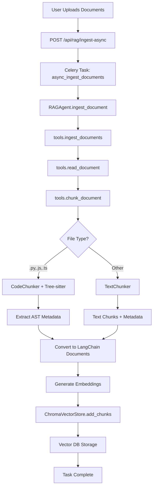

# RAG Integration Flow

**Version:** 1.1.0  
**Last Updated:** 2026-05-19  
**Last Verified:** 2026-05-19 — graph expansion provenance fields wired end-to-end, see `§Changelog`

This document details the integration flow of the RAG pipeline, including Phase 12A query intelligence features.

---

## Complete Ingestion Flow

### High-Level Pipeline



### Detailed Call Chain

```
1. HTTP Request
   POST /api/rag/ingest-async
   Body: {"file_paths": ["utils.py"], "collection_name": "devforge_docs"}
   
2. API Endpoint (src/api/routers/__init__.py)
   async def ingest_async_endpoint(request: IngestAsyncRequest)
   ↓
   Creates Celery task
   
3. Celery Task Queue (src/workers/tasks/rag_tasks.py)
   @shared_task
   def async_ingest_documents(file_paths, collection_name)
   ↓
   Initializes RAGAgent
   
4. RAGAgent (src/agents/rag/agent.py)
   async def ingest_document(file_path)
   ↓
   Delegates to tools layer
   
5. Tools Layer (src/tools/rag/tools.py)
   async def ingest_documents(file_paths, ...)
   ↓
   Parallel file reading
   
6. Document Reading
   async def read_document(file_path) -> str
   ↓
   Returns text content
   
7. Chunking Decision (tools.chunk_document)
   def chunk_document(text, file_path, chunk_size, chunk_overlap)
   ↓
   Checks file extension
   
8A. Code Path (.py, .js, .ts)
    CodeChunker.chunk(text, file_path)
    ↓
    Tree-sitter AST parsing
    ↓
    Extract: functions, classes, imports, calls, docstrings
    ↓
    Return chunks with rich metadata
    
8B. Text Path (.md, .txt, .pdf, .docx)
    TextChunker.chunk(text, file_path)
    ↓
    RecursiveCharacterTextSplitter
    ↓
    Return chunks with basic metadata
    
9. Convert to LangChain Format
   Document(page_content=content, metadata=metadata)
   
10. Generate Embeddings
    OllamaEmbeddings.embed_documents(contents)
    
11. Store in Vector DB
    ChromaVectorStore.add_chunks(chunks, embeddings)
    ↓
    collection.add(ids, embeddings, metadatas, documents)
    
12. Return Result
    {"success": true, "chunks_created": 15, "task_id": "..."}
```

---

## Phase 12A Retrieval Flow (Query Intelligence)

### Enhanced Pipeline

```
1. User Query
   POST /api/v1/rag/chunk/semanticSearchForChat
   Headers: Authorization: Bearer <tenant_jwt>
   Body: {"query": "...", "top_k": 5}

   Note: retrieve_docs is NOT in SUPPORTED_TOOLS and is not callable via
   POST /api/gateway. The canonical entry point is semanticSearchForChat.

2. Intent Classification (3-tier)
   IntentClassifier.classify(query)
   ↓
   Tier 1: Rule-based keywords (fast, 0ms)
   Tier 2: LLM classification (if enabled, 100ms)
   Tier 3: Default fallback → "general"
   ↓
   Returns: code_search | explain | debug | general
   
3. Query Expansion (intent-aware)
   QueryExpander.expand(query, intent)
   ↓
   Generate 2-3 related queries based on intent
   ↓
   e.g., "RAG config" → ["RAG configuration", "RAG_EMBED_MODEL", "RAG settings"]
   
4. Semantic Cache Check
   SemanticCache.get(query, intent)
   ↓
   If similarity ≥ 0.92 → Return cached result (10ms)
   Else → Continue to retrieval
   
5. Multi-Query Vector Search
   For each expanded query:
     ChromaVectorStore.similarity_search(query, top_k)
   ↓
   Returns multiple result sets
   
6. Result Fusion (RRF)
   ResultFusion.fuse(all_results)
   ↓
   Reciprocal Rank Fusion + Deduplication
   ↓
   Returns merged, ranked results
   
7. Cross-Encoder Reranking
   Reranker.rerank(query, fused_results)
   ↓
   Stage 2 precision ranking
   
8. Deterministic Context Shaping (Phase 13)
   ContextShaper.shape_context(reranked_results)
   ↓
   - Deduplicate by Qualified ID
   - Assign Roles (Entry / Dependency / Supporting)
   - Apply Hard Limits (Max 12)
   
9. Response Generation
   model_router.select_model("rag_simple", prefer_local=False)
   ↓
   Uses cloud model (gpt-oss:20b-cloud) for memory efficiency
   ↓
   Generate answer from context
   
9. Cache Update
   SemanticCache.set(query, intent, result)
   
10. Return Response
    {
      "success": true,
      "data": {
        "response": "...",
        "documents": [...],
        "backend": "chroma"
      }
    }
```

### Analytics Endpoints (Phase 12A)

| Endpoint | Purpose |
|----------|---------|
| `GET /api/rag/analytics/intent-distribution` | Intent classification stats |
| `GET /api/rag/analytics/expansion-quality` | Query expansion metrics |
| `GET /api/rag/analytics/cache-by-intent` | Cache hit rates by intent |
| `GET /api/rag/analytics/fallback-usage` | Fallback trigger frequency |
| `GET /api/rag/metrics` | Overall system metrics |

---

## Graph Expansion Detail

Code-graph BFS expansion happens unconditionally when `ENABLE_CODE_GRAPH=true`
(there is no per-request `include_context` flag). It runs inside the Phase 12A
pipeline after the initial vector/hybrid results are collected:

```
For each result chunk:
  ↓
Extract QID (tenant::file::entity)
  ↓
CodeGraph.get_related(qid, depth=2, max_results=3)
  ↓
BFS traversal of calls/imports edges
  ↓
Fetch related chunks via vector_store.get_chunk_by_qualified_id(related_qid)
  ↓
Set is_graph_expansion=True and expanded_from=<anchor_qid> on each expanded chunk dict
  ↓
Merge initial_results + related_chunks → deduplicate by QID → pass to reranker
```

**Provenance fields on expanded chunks** (`src/agents/rag/agent.py: _expand_with_graph_context`):

```python
chunk_dict = {
    "id": related_chunk.id,
    "content": related_chunk.content,
    "metadata": related_chunk.metadata,
    "score": 0.0,
    "is_graph_expansion": True,
    "expanded_from": qid,   # anchor QID that triggered this expansion
}
```

These fields propagate through `ChunkResult` → router extraction → `ChatFileChunk` → `SemanticSearchResponse`. The response also includes a top-level `expansion_count` field (count of chunks where `is_graph_expansion=True`).


## Code Path Details

### 1. RAGAgent.ingest_document

**File:** `src/agents/rag/agent.py` (lines 502-537)

```python
async def ingest_document(self, file_path: str, embed_model: Optional[str] = None) -> dict:
    from src.tools.rag.tools import ingest_documents as _ingest_documents
    
    # ARCHITECTURE: Delegates to tools layer
    result = await _ingest_documents(
        file_paths=[file_path],
        embed_model=embed_model or self.embed_model,
        chunk_size=settings.RAG_CHUNK_SIZE,
        chunk_overlap=settings.RAG_CHUNK_OVERLAP,
        backend=self.backend,
    )
    
    logger.info(f"Document ingested: {file_path}", extra={"chunks": result.get("chunks_created", 0)})
    return result
```

**Status:** ✅ Calls `tools.ingest_documents`

---

### 2. tools.ingest_documents

**File:** `src/tools/rag/tools.py` (lines 354-445)

```python
async def ingest_documents(file_paths, embed_model, chunk_size, chunk_overlap, backend):
    # Read all documents in parallel
    read_tasks = [read_document(fp) for fp in file_paths]
    contents = await asyncio.gather(*read_tasks, return_exceptions=True)
    
    # Process each document
    all_chunks = []
    for file_path, content in zip(file_paths, contents):
        if isinstance(content, Exception):
            logger.warning(f"Failed to read {file_path}: {content}")
            continue
        
        try:
            # CRITICAL: Call chunk_document for each file
            chunks = chunk_document(
                text=content,
                file_path=file_path,
                chunk_size=chunk_size,
                chunk_overlap=chunk_overlap,
            )
            all_chunks.extend(chunks)
        except Exception as e:
            logger.warning(f"Failed to chunk {file_path}: {e}")
    
    # Add to vector store
    if all_chunks:
        vector_store.add_documents(all_chunks)
    
    return {"success": True, "chunks_created": len(all_chunks)}
```

**Status:** ✅ Calls `chunk_document()` for each file

---

### 3. tools.chunk_document

**File:** `src/tools/rag/tools.py` (lines 259-331)

```python
def chunk_document(text: str, file_path: str, chunk_size: int, chunk_overlap: int) -> List[Document]:
    """Phase 10.1: Uses Tree-sitter for code, falls back to text."""
    
    try:
        # NEW: Code-aware chunking
        from src.agents.rag.chunking import CodeChunker, TextChunker
        
        code_chunker = CodeChunker()
        
        # Decision point: Code or Text?
        if code_chunker.is_supported(file_path):  # Check .py, .js, .ts, .tsx, .jsx
            # AST parsing for code files
            chunks_data = code_chunker.chunk(text, file_path)
            logger.info(f"Code chunking: {len(chunks_data)} chunks from {file_path}")
        else:
            # Text chunking for other files
            text_chunker = TextChunker(chunk_size, chunk_overlap)
            chunks_data = text_chunker.chunk(text, file_path)
            logger.info(f"Text chunking: {len(chunks_data)} chunks from {file_path}")
        
        # Convert to LangChain Document format
        documents = [
            Document(page_content=c["content"], metadata=c["metadata"])
            for c in chunks_data
        ]
        
        return documents
        
    except ImportError:
        # Legacy fallback: RecursiveCharacterTextSplitter
        logger.warning("Chunkers not available, using legacy mode")
        text_splitter = RecursiveCharacterTextSplitter(chunk_size=chunk_size, chunk_overlap=chunk_overlap)
        chunks = text_splitter.create_documents([text])
        for i, chunk in enumerate(chunks):
            chunk.metadata = {"source": file_path, "chunk_index": i}
        return chunks
```

**Status:** ✅ Uses code-aware chunkers with AST parsing

### 4. CodeChunker.chunk

**File:** `src/agents/rag/chunking/code_chunker.py` (lines 89-144)

```python
def chunk(self, content: str, file_path: str) -> List[Dict]:
    """Chunk code using AST parsing. Falls back to text on error."""
    
    ext = Path(file_path).suffix.lower()
    language = SUPPORTED_LANGUAGES.get(ext)  # {'.py': 'python', '.js': 'javascript', '.ts': 'typescript'}
    
    if not language or language not in self.parsers:
        return self.text_fallback.chunk(content, file_path)
    
    try:
        return self._chunk_with_ast(content, file_path, language)
    except Exception as e:
        logger.warning(f"AST parsing failed for {file_path}: {e}, falling back to text")
        return self.text_fallback.chunk(content, file_path)

def _chunk_with_ast(self, content: str, file_path: str, language: str) -> List[Dict]:
    """Parse code with Tree-sitter and extract chunks."""
    from tree_sitter import Parser
    
    # Create parser with language
    lang_obj = self.parsers[language]
    parser = Parser(lang_obj)
    tree = parser.parse(bytes(content, 'utf8'))
    
    chunks = []
    
    # Extract imports
    imports = self._extract_imports(tree.root_node, content, file_path, language)
    chunks.extend(imports)
    
    # Extract functions and classes
    entities = self._extract_entities(tree.root_node, content, file_path, language)
    chunks.extend(entities)
    
    return chunks
```

**Metadata Extracted:**
- `chunk_type`: "function", "class", "import", "text"
- `name`: Entity name (e.g., "add", "User")
- `language`: "python", "javascript", "typescript"
- `source`: File path
- `start_line`, `end_line`: Line numbers
- `imports`: List of import statements
- `calls`: List of function calls within entity
- `docstring`: Extracted docstring/JSDoc

---

## Graph Rebuild Flow

### RAGAgent.init_graph

**File:** `src/agents/rag/agent.py`

The graph is NOT a lazy `@property`. It requires explicit initialization via
`await agent.init_graph()`. Accessing `agent.code_graph` before calling
`init_graph()` raises `RuntimeError`.

```python
async def init_graph(self) -> None:
    cache_key = f"rag_graph:v2:{self.collection_name}"
    cached = redis_client.get(cache_key)
    if cached:
        graph_dict = json.loads(cached)
        # Reject legacy 2-segment QIDs and fall through to rebuild
        if all(len(qid.split("::")) >= 3 for qid in graph_dict):
            self._code_graph = CodeGraph.from_dict(graph_dict)
            return

    # Cache miss: rebuild from vector store metadata
    self._code_graph = CodeGraph()
    async for batch in self.vector_store.iter_chunk_metadata(batch_size=500):
        self._code_graph.add_chunks_batch(batch, tenant_id=self.tenant_id)

    # Write back to Redis with 1-hour TTL
    redis_client.set(cache_key, json.dumps(self._code_graph.to_dict()), ex=3600)
```

**Flow:**
1. Try Redis warm-start cache (key `rag_graph:v2:{collection_name}`, 1-hour TTL)
2. Reject cached graphs that contain legacy 2-segment QIDs → fall through to rebuild
3. Cache miss: stream chunk metadata via `BaseVectorStore.iter_chunk_metadata()` (NO embeddings loaded)
4. For each batch, build QIDs (`tenant::file::entity`) and add to graph
5. Write rebuilt graph back to Redis
6. Cache is invalidated by `ingest_document` and `delete_file_cascade`

---

## Integration Verification ✅

| Step | Method | Status | Notes |
|------|--------|--------|-------|
| 1 | Celery → RAGAgent.ingest_document | ✅ | Architecture compliant |
| 2 | RAGAgent → tools.ingest_documents | ✅ | Delegates to tools |
| 3 | tools.ingest_documents → chunk_document | ✅ | Per-file processing |
| 4 | chunk_document → CodeChunker/TextChunker | ✅ | Automatic detection |
| 5 | CodeChunker → Tree-sitter AST | ✅ | Python, JS, TS support |
| 6 | Extract metadata | ✅ | Functions, classes, imports, calls |
| 7 | Convert to LangChain Documents | ✅ | Standard format |
| 8 | ChromaVectorStore.add_chunks | ✅ | BaseVectorStore abstraction |

---

## Metadata Flow Example

### Input: utils.py

```python
def add(a, b):
    """Add two numbers."""
    return a + b

def validate(value):
    if value < 0:
        raise ValueError("Negative")
    return add(value, 1)
```

### Output: Chunks

```json
[
  {
    "content": "def add(a, b):\n    \"\"\"Add two numbers.\"\"\"\n    return a + b",
    "metadata": {
      "chunk_type": "function",
      "name": "add",
      "language": "python",
      "source": "utils.py",
      "start_line": 1,
      "end_line": 3,
      "imports": [],
      "calls": [],
      "docstring": "Add two numbers."
    }
  },
  {
    "content": "def validate(value):...",
    "metadata": {
      "chunk_type": "function",
      "name": "validate",
      "language": "python",
      "source": "utils.py",
      "start_line": 5,
      "end_line": 8,
      "imports": [],
      "calls": ["add"],  // Detected function call
      "docstring": null,
      "role": "dependency"
    }
  }
]
```

### Graph Structure

```
tenant123::utils.py::validate → tenant123::utils.py::add  (call edge)
```

### QID Format

```
QID: tenant123::utils.py::add
     └─ tenant └─ file  └─ entity

QID: tenant123::utils.py::validate
     └─ tenant └─ file   └─ entity
```

---

## Related Documentation

- [RAG Architecture](../rag_architecture.md) — Architecture rules and component overview
- [retrieve_docs](./retrieve_docs.md) — Endpoint reference and usage
- [Sequential Chunk Retrieval](./get_file_chunks_api.md) — Direct chunk access for files

---

## Changelog

### 2026-05-19 — v1.1.0: Graph Expansion Provenance

- Updated Graph Expansion Detail section: documents `is_graph_expansion=True` and `expanded_from=<anchor_qid>` being set on each BFS-expanded chunk dict in `_expand_with_graph_context()`.
- Documents the full propagation path: `_expand_with_graph_context` → `ChunkResult` → router → `ChatFileChunk` → `SemanticSearchResponse.expansion_count`.

---

**Last Updated:** 2026-05-19
